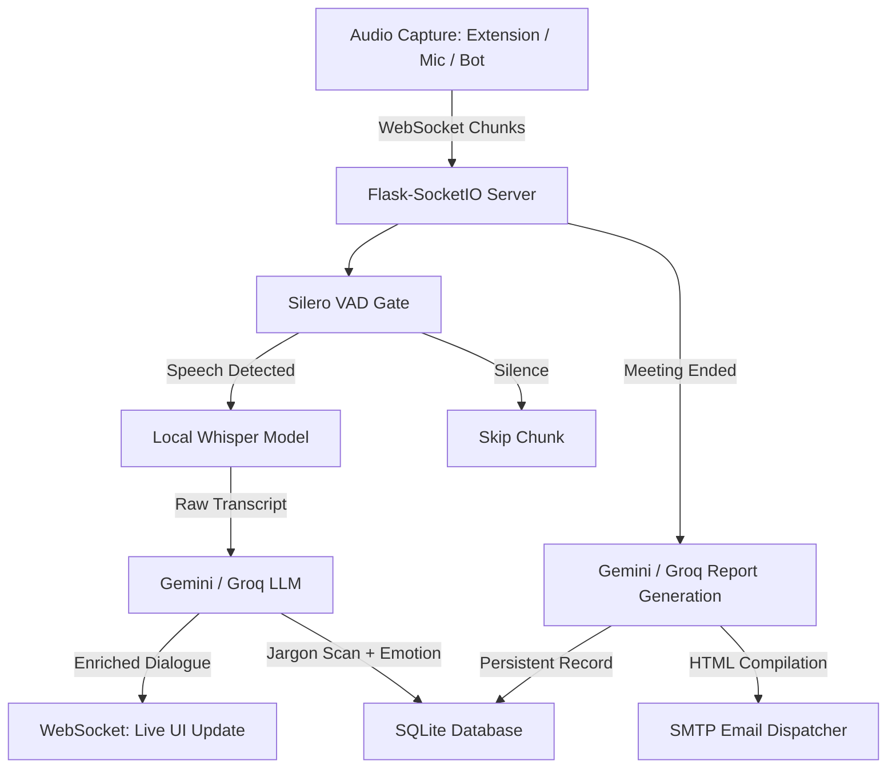

# VibeNote AI — Real-Time Sentiment & AI Meeting Analytics

VibeNote AI is a premium, real-time meeting analytics dashboard that captures conversation audio streams, performs voice activity filtering, transcribes speech, models participant emotions, flags technical industry jargon, and compiles structured post-meeting executive reports.

---

## 🌟 What is VibeNote AI?
During busy calls, team members often miss key action items, misunderstand industry acronyms, or struggle to gauge overall sentiment trends. VibeNote AI solves this by acting as an automated intelligence layer that sits alongside your meetings. 

Whether capturing audio via a **direct microphone feed**, a **Chrome tab capture extension**, **batch file uploads**, or an **autonomous headless meeting bot** (Google Meet, Zoom, MS Teams), VibeNote processes dialogue instantly and preserves reports forever in a local database.

---

## 🚀 Key Features

*   **🎙️ Multi-Channel Capture Pipelines**:
    *   **Direct Audio**: Streams live microphone chunks directly from the browser.
    *   **Browser Extension**: Captures system tab audio directly from Google Meet or Zoom.
    *   **Headless Meeting Bots**: Playwright-based background bots that automatically join calls, record combined audio channels, and stream it to the backend.
*   **⚡ Voice Activity Detection (VAD)**:
    *   Integrated with **Silero VAD** (CPU-optimized, <5ms latency) to detect speech. Silent segments bypass Whisper, preserving computing power and LLM quotas.
*   **🧠 Real-Time Dialogue Enrichment**:
    *   **OpenAI Whisper**: High-performance local transcription with speaker tracking.
    *   **Sentiment Timeline**: Dynamic Chart.js dashboard mapping emotion trends (Positive, Negative, Hesitant, Confused, Enthusiastic, Neutral).
    *   **Jargon scan**: Automatic matching against a local vertical database (Manufacturing, Construction, Financial Services) showing definition tooltips on hover.
*   **📂 Persistent Archival & History Tab**:
    *   Powered by a thread-safe **SQLite database** to store meeting metadata, transcripts, jargon scans, and summary reports.
    *   An interactive **History dashboard tab** lets users browse past meetings, search, and view detailed modal reports.
*   **✉️ Post-Meeting Executive Summary**:
    *   LLM-powered (Gemini/Groq) markdown report detailing strategic decisions, parsed action items (owner, task, deadline), and aggregate sentiment.
    *   **Email Dispatch**: Automatically emails a beautifully formatted HTML report directly to the attendee's inbox upon meeting finalization.

---

## 📂 Project Structure

```text
vibenote/
├── backend/
│   ├── app.py                # Flask app with Flask-SocketIO & CORS REST API
│   ├── config.py             # Configuration system loading env variables
│   ├── database.py           # Thread-safe SQLite persistence layer
│   ├── email_sender.py       # Post-meeting HTML report email sender
│   ├── requirements.txt      # Python dependencies (Whisper, Playwright, CPU PyTorch)
│   ├── run.py                # Unified app entry point and configuration checklist
│   ├── test_pipeline.py      # Automated pipeline test suite
│   ├── vad.py                # Silero Voice Activity Detection (VAD) gate
│   ├── bot/                  # Autonomous Headless Meeting Bot
│   │   ├── base_bot.py       # Abstract Base Bot class with SocketIO emitters
│   │   ├── bot_launcher.py   # Threaded background bot manager
│   │   ├── meet_bot.py       # Playwright Google Meet bot
│   │   ├── zoom_bot.py       # Playwright Zoom web client bot
│   │   ├── teams_bot.py      # Playwright Teams web client bot
│   │   └── xvfb_manager.py   # Xvfb headless display buffer manager for Linux
│   └── .env.example          # Environment variables template
├── frontend/
│   ├── index.html            # Neon-dark styled glassmorphic dashboard UI with History Tab
│   ├── app.js                # SocketIO client, MediaRecorder pipelines, & Chart.js
│   └── styles.css            # Dark theme, layout grids, and animations
├── extension/
│   ├── manifest.json         # Chrome Extension Manifest V3 config
│   ├── content.js            # Message relay bridge in the browser tab context
│   ├── background.js         # Service Worker & Popup Controller
│   └── popup.html            # Popup capture control UI
├── docker-compose.yml        # Docker service definition with XVFB and Playwright support
└── README.md                 # Project setup and usage instructions
```

---

## 🛠️ System Architecture & Data Flow



---

## 🚀 Getting Started

### 1. Configure Secret Environment Variables
Create a `.env` file inside the `backend/` directory (`backend/.env`) with your api keys:
```env
GEMINI_API_KEY=your_gemini_api_key_here
GROQ_API_KEY=your_groq_api_key_here
HF_TOKEN=your_hugging_face_token_here

# SMTP Configuration for Email reports
SMTP_SERVER=smtp.gmail.com
SMTP_PORT=587
SMTP_USERNAME=your_email@gmail.com
SMTP_PASSWORD=your_app_password_here

# Bot configuration
DISPLAY=:99
BOT_NAME=VibeNote Bot
```
> [!IMPORTANT]
> The Hugging Face Token (`HF_TOKEN`) is required to authorize the Pyannote speaker diarization models. Make sure you accept the repository terms at [pyannote/speaker-diarization-3.1](https://huggingface.co/pyannote/speaker-diarization-3.1).

---

### Option A: Run via Docker Compose (Recommended)
Docker comes pre-configured with Xvfb (Virtual Framebuffer) and Pulseaudio required to spin up headless browsers and record tab audio streams on Linux environments:

1.  **Build and start the services**:
    ```bash
    docker-compose up --build
    ```
2.  **Open the client**:
    Open `frontend/index.html` in your web browser.
3.  **Initiate a session**:
    Input your meeting URL, select your industry, and start recording. The background playwright bot will automatically join the room.

---

### Option B: Local Setup (Windows / macOS)

1.  **Install Python dependencies**:
    ```bash
    cd backend
    python -m venv venv
    
    # Activate environment
    # On Windows:
    .\venv\Scripts\activate
    # On macOS/Linux:
    source venv/bin/activate
    
    pip install -r requirements.txt
    playwright install chromium
    ```
2.  **Start the backend server**:
    ```bash
    python run.py
    ```
3.  **Open the Dashboard**:
    Open `frontend/index.html` in Google Chrome or any modern browser.

---

## 🔌 Installing the Chrome Extension
If you prefer to stream audio directly from your active browser tab instead of utilizing the background meeting bot:
1.  Open Google Chrome and navigate to `chrome://extensions/`.
2.  Toggle **Developer mode** ON (top-right corner).
3.  Click **Load unpacked** (top-left) and select the `extension/` directory.
4.  Input the server URL `http://localhost:5000` in the extension popup and click **Capture Tab Audio**.

---
